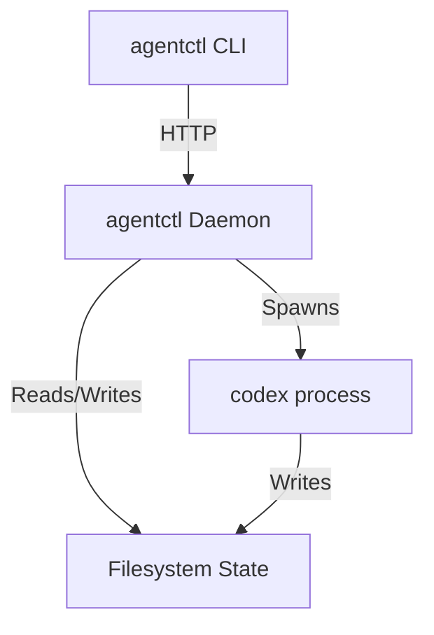

# AGENTCTL Specification

## 1. Overview

`agentctl` is a tool to manage the lifecycle of AI agents (specifically `codex` instances) in a devcontainer environment. It provides visibility, traceability, and robust process management.

### Core Philosophy
-   **Visibility**: All state is persisted to disk in a human-readable/machine-parseable format.
-   **Reliability**: Long-running processes are managed by a daemon, not attached to the CLI shell.
-   **Simplicity**: The CLI is a thin client. The Daemon handles the complexity.

## 2. Glossary & Terminology

To avoid ambiguity, the following terms are used strictly:

-   **Thread**: A single conversation history with an agent. Identified by a `thread_id` (UUID).
-   **Turn**: A single execution of the agent within a Thread. It starts with a user prompt and ends when the agent produces a final message or is stopped.
-   **Session**: Synonymous with **Thread** in `codex` terminology.
-   **Codex Process**: The OS process running the `codex` CLI. One process corresponds to one Turn.
-   **Daemon**: The `agentctl` background service.

## 3. Architecture

The system consists of three components:
1.  **Daemon**: A long-running background process (HTTP server) that manages `codex` child processes.
2.  **CLI**: A thin client that sends HTTP requests to the Daemon.
3.  **State**: A structured directory of files acting as the source of truth.



**Important**: The daemon must be running for all CLI commands (except `agentctl daemon` itself). Start it with `agentctl daemon` in a separate terminal or use `--background` to daemonize.

## 4. State & Data Model

All state is stored in `~/.agentctl/state/` (configurable via `AGENTCTL_STATE_DIR`).

### Directory Structure
```text
~/.agentctl/state/
├── daemon.pid          # PID of the running daemon
├── daemon.port         # Port the daemon is listening on
└── threads/
    └── <thread_id>/
        └── status.json # Current state (Running, Done, Failed)
```

### `status.json`
```json
{
  "id": "thread-123",
  "pid": 4567,
  "status": "running", // running, done, failed, aborted
  "exit_code": null,
  "workdir": "/path/to/workdir",
  "managed": "daemon",
  "session_file": "/home/user/.codex/sessions/2025/11/22/rollout-...jsonl",
  "originator": "codex_exec",
  "source": "exec",
  "codex_cwd": "/path/to/workdir",
  "created_at": "2023-10-27T10:00:00Z",
  "updated_at": "2023-10-27T10:00:05Z"
}
```

### Session file pointer
We no longer pipe/duplicate Codex stdout. Instead we store a pointer to the Codex transcript (`session_file`) and pull metadata from its first `session_meta` line. For portability you may copy/link that file into the thread dir if desired.

## 5. Codex Integration

### Real Codex (daemon-managed exec)
The daemon spawns `codex exec` and discovers the session via the Codex session file rather than parsing stdout.

- **Command**: `codex exec [resume <thread_id>] --yolo --json --output-last-message <TMP> --cd <WORKDIR> <PROMPT>`
- **Discovery**: After spawn, the daemon looks in `AGENTCTL_CODEX_SESSIONS_DIR` (default `~/.codex/sessions`) for the newest `rollout-*.jsonl` modified after spawn, reads its first `session_meta` line, and uses `id/cwd/originator/source`.
- **Timeout**: `AGENTCTL_DISCOVERY_TIMEOUT_MS` / `AGENTCTL_HANDSHAKE_TIMEOUT_MS` (default 1000 ms). On timeout it kills the process and returns an error.
- **Status init**: Writes `status.json` with `managed=daemon`, `session_file`, metadata; returns `thread_id` to the HTTP caller. The Codex process keeps running in the background.
- **Exit**: On child exit, status becomes `done`/`failed` unless already `aborted`; the temp `--output-last-message` file is moved to `threads/<id>/final_message.txt`.

### Mock Codex (for testing)
- Writes realistic session files to `AGENTCTL_CODEX_SESSIONS_DIR` (set to a temp dir in tests), first line is `session_meta`.
- Reads instructions from `AGENTCTL_CODEX_MOCK_INSTRUCTION_FILE` JSONL (supports `_mock_delay_ms`, `_mock_exit_code`).
- Optional `AGENTCTL_MOCK_SESSION_DELAY_MS` delays session-file creation to simulate slow startup.

## 6. Daemon API Contract

The daemon exposes a JSON HTTP API.

### `POST /turn/start`
Starts a new daemon-managed exec turn.
-   **Body**: `{ "prompt": "...", "workdir": "...", "thread_id": "(optional)" }`
-   **Behavior**:
    1.  **Spawn**: Spawns `codex exec ...` detached.
    2.  **Discover**: Within the discovery timeout, finds the newest `rollout-*.jsonl` under the Codex sessions dir with mtime after spawn and matching optional `thread_id`/`cwd`; reads `session_meta` for `id`/`cwd`/`originator`/`source`.
    3.  **Init**: Writes `status.json` (`managed=daemon`, `session_file`, metadata) under `threads/<id>/`.
    4.  **Response**: Returns `{ "thread_id": "...", "status": "running" }` to the client.
    5.  **Continue**: The Codex process continues in the background; exit handler sets `done|failed` unless already `aborted`.

### `GET /turn/:id`
Gets the status of a turn (by `thread_id`).
-   **Response**: Returns the content of `status.json`.

### `POST /turn/stop`
Stops a running daemon-managed turn.
-   **Body**: `{ "thread_id": "..." }`
-   **Behavior**: Rejects if `managed=external`; otherwise SIGTERM and mark `aborted`.

### `POST /external/start`
Register an externally managed Codex session (e.g., TUI via `agentctl codex-tui`).
-   **Body**: `{ "thread_id": "...", "workdir": "...", "pid"?, "session_file"?, "originator"?, "source"?, "codex_cwd"?, "notes"?, "managed": "external" }`
-   **Behavior**: Writes `status.json` with `managed=external`, `status=running`.

### `POST /external/finish`
Finalize an externally managed session.
-   **Body**: `{ "thread_id": "...", "exit_code"?, "status"? }`
-   **Behavior**: Sets status to provided value or `done|failed` based on `exit_code`.

### `GET /list`
Lists all threads.
-   **Query**: `?status=running` (optional filter)
-   **Response**: `[ { "id": "...", "status": "..." }, ... ]`

### `GET /health`
Simple readiness/liveness probe for orchestration.
-   **Response**: `{ "status": "ok", "pid": <number>, "port": <number>, "uptime_s": <seconds> }`

### Configurable timeouts (daemon)
- `AGENTCTL_DISCOVERY_TIMEOUT_MS` / `AGENTCTL_HANDSHAKE_TIMEOUT_MS` (default `1000`): Maximum time to discover the session file after spawn.
- `AGENTCTL_CODEX_SESSIONS_DIR`: Override Codex session root (default `~/.codex/sessions`).
- `AGENTCTL_CODEX_MOCK_INSTRUCTION_FILE`: JSONL for mock codex.
- `AGENTCTL_MOCK_SESSION_DELAY_MS`: Simulate slow session creation in mock codex.

## 7. CLI Syntax

The CLI is the primary interface for users and agents.

**Global options**
- `--json`: emit machine-readable JSON to stdout. For `list` this returns a JSON array; combine with `--jsonl` for NDJSON.

### Commands

#### `agentctl self`
Goal: a CLI command that tells the caller who they are.

- **Must (per project owner):**
    - When invoked inside a Codex/agent shell, print that agent's UUID.
    - When invoked by the project owner (i.e., not inside a Codex shell), print `project_owner`.
    - Agent-context detection should rely on the existing convention `CODEX_SHELL_ENV=1` (per `~/.codex/config.toml`).
    - "unknown" output is acceptable **only** to signal: inside a Codex shell but **not** an agent managed by `agentctl`. It must not be emitted merely because a lookup failed for an agentctl-managed session.
    - Therefore the implementation must attempt a best-effort lookup before resorting to `unknown`; always printing `project_owner` or `unknown` would violate the feature requirements.

- **Implementation:**
    - Uses PID-based ancestry matching: traces the calling process's parent chain via `/proc/<pid>/status` and matches against `~/.agentctl/state/threads/*/status.json`
    - Detection order:
        1. If `CODEX_SHELL_ENV` not set → return `project_owner`
        2. Traverse process ancestry to find parent `codex` process PID
        3. Match PID against daemon's thread state files
        4. If no match found → return `unknown` (exit code 1)
    - Deterministic, concurrency-safe, works for both new and resumed threads
    - Requires no modifications to Codex binary
    - **Platform-specific**: Linux-only (uses `/proc` filesystem)
        - macOS/Windows: Daemon and other commands work fine, but `agentctl self` will fail
        - Alternative: Could use `ps` on macOS or WMIC on Windows (future work)

- **Exit codes:**
    - `0`: Successfully identified (project_owner or agent UUID)
    - `1`: Inside Codex shell but identity unknown (not managed by agentctl)


#### `agentctl daemon`
Starts the daemon process.
-   **Options**: `--port <port>` (default 3000), `--background` (optional).

#### `agentctl start [PROMPT]`
Starts a new turn.
-   **Options**:
    -   `--workdir <path>`: Working directory for the agent.
    -   `--thread <id>`: Continue existing thread (if supported by codex) or reuse ID.
    -   `--detach`: Return immediately (default = true).
    -   `--await`: Wait for completion (blocks). Equivalent to `--detach=false`.
-   **Output**: Prints the `thread_id` (or a JSON object with the `thread_id` and status when `--json` is set). When combined with `--await --json`, the final status JSON is printed.

#### `agentctl status <ID>`
Prints the status of a thread.
-   **Output**: Pretty-printed JSON by default; compact JSON when `--json` is set.

#### `agentctl await <ID>`
Polls the daemon until the thread reaches a terminal state (done, failed, aborted).
-   **Options**: `--timeout <seconds>`
-   **Exit Code**: 0 on success, 1 on failure, 124 on timeout.
-   **Output**: Silent by default; when `--json` is set, prints the final status JSON.

#### `agentctl list`
Lists all threads.
-   **Options**:
    - Default output: plain single-line entries (`id status managed pid exit_code workdir`) for easy grepping.
    - `--json`: Output the list as a JSON array (pretty-printed).
    - `--jsonl`: Emit NDJSON (one thread per line) for streaming use.
    - `--status <filter>`: Filter by status.

#### `agentctl stop <ID>`
Stops a daemon-managed thread. Rejects external threads with a clear error.

#### `agentctl codex-tui [thread_id] -- <args>`
Runs Codex interactively (TUI) in the foreground, discovers the session file, and registers it as `managed=external`. Fails fast if registration fails. Positional `thread_id` (or `--resume`) is forwarded to `codex resume`; everything after `--` is passed verbatim to Codex.

## 8. Implementation Guidelines for Programmer Agent

1.  **Language**: Use a robust systems language or runtime (Rust, Go, or Node.js/TypeScript). Node.js is preferred if the environment is already JS-heavy, otherwise Rust for single-binary portability. *Decision: Node.js (TypeScript) is likely easiest given the devcontainer has it and it handles JSON/HTTP well.*
    -   *Recommendation*: Check if the **Codex SDK** (e.g., `@openai/codex-sdk`) is available. It wraps the CLI and provides typed `JSONL` events, which is safer than parsing stdout manually.
2.  **Resilience**: The daemon must handle `codex` crashing or hanging.
3.  **Concurrency**: The daemon handles multiple threads, but `codex` might lock the database/worktree. The daemon does NOT enforce locking; it assumes the user/agent manages conflicts.
4.  **Testing**:
    -   Implement the Mock Codex first.
    -   Write an integration test suite that spins up the daemon, runs the mock, and asserts on state files.
    -   Test the "happy path" (start -> await -> success) and "sad path" (start -> stop -> aborted).

## 9. Concurrency & Locking

-   **Daemon Level**: The daemon must handle concurrent HTTP requests safely. Node.js event loop handles this naturally for I/O, but file writes must be safe.
-   **Thread Level**: Operations on a specific thread (start, stop) should be serialized or atomic *for that thread*.
-   **Global Lock**: A global lock is **not required** for read operations (`list`, `status`). However, `start` (spawning a new process) should be robust against race conditions if multiple requests try to create the same `thread_id` (though `thread_id` is usually unique).
-   **Codex Locking**: We assume `codex` handles its own locking for the workspace/database. `agentctl` does not need to enforce this.

## 10. Documentation Requirements

The programmer agent must also deliver:
1.  **Root `AGENTS.md`**: Update the `agentctl` section to reflect the final CLI commands and usage.
2.  **`packages/agentctl/AGENTS.md`**: Create a new onboarding file for `agentctl` developers/maintainers. It should cover:
    -   How to build/run the daemon locally.
    -   How to run the integration tests.
    -   Troubleshooting common daemon issues.

## 11. Future Proofing
-   **Second Daemon**: If we need a separate "watcher" daemon later, it can consume the `state` directory independently.
-   **Polling**: The CLI `await` command implements polling so the daemon doesn't need long-held connections.
