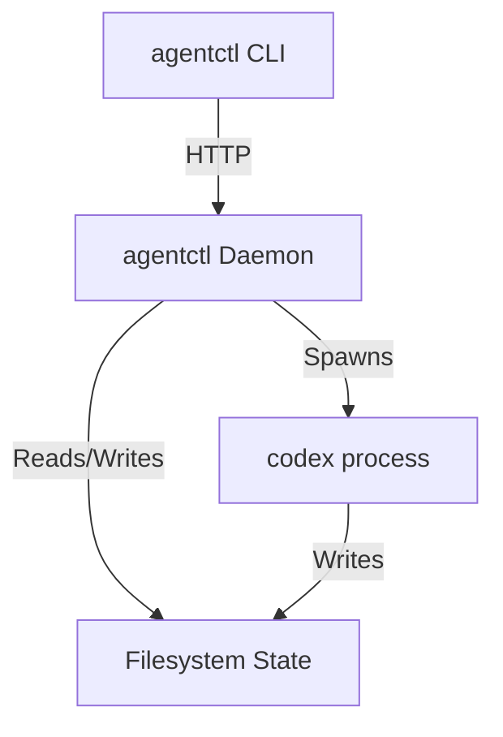

# AGENTCTL Specification

## 1. Overview

`agentctl` is a tool to manage the lifecycle of AI agents (specifically `codex` instances) in a devcontainer environment. It provides visibility, traceability, and robust process management.

### Core Philosophy
-   **Visibility**: All state is persisted to disk in a human-readable/machine-parseable format.
-   **Reliability**: Long-running processes are managed by a daemon, not attached to the CLI shell.
-   **Simplicity**: The CLI is a thin client. The Daemon handles the complexity.

## 2. Glossary & Terminology

To avoid ambiguity, the following terms are used strictly:

-   **Thread**: A single conversation history with an agent. Identified by a `thread_id` (UUID).
-   **Turn**: A single execution of the agent within a Thread. It starts with a user prompt and ends when the agent produces a final message or is stopped.
-   **Session**: Synonymous with **Thread** in `codex` terminology.
-   **Codex Process**: The OS process running the `codex` CLI. One process corresponds to one Turn.
-   **Daemon**: The `agentctl` background service.

## 3. Architecture

The system consists of three components:
1.  **Daemon**: A long-running background process (HTTP server) that manages `codex` child processes.
2.  **CLI**: A thin client that sends HTTP requests to the Daemon.
3.  **State**: A structured directory of files acting as the source of truth.



## 4. State & Data Model

All state is stored in `~/.agentctl/state/` (configurable via `AGENTCTL_STATE_DIR`).

### Directory Structure
```text
~/.agentctl/state/
├── daemon.pid          # PID of the running daemon
├── daemon.port         # Port the daemon is listening on
└── threads/
    └── <thread_id>/
        ├── status.json # Current state (Running, Done, Failed)
        ├── log.jsonl   # Append-only event log
        ├── stdout.log  # Raw stdout from codex
        └── stderr.log  # Raw stderr from codex
```

### `status.json`
```json
{
  "id": "thread-123",
  "pid": 4567,
  "status": "running", // running, done, failed, aborted
  "exit_code": null,
  "workdir": "/path/to/workdir",
  "created_at": "2023-10-27T10:00:00Z",
  "updated_at": "2023-10-27T10:00:05Z"
}
```

### `log.jsonl`
Events: `turn_start`, `turn_end`, `process_spawn`, `process_exit`.

> **Design Note**: We maintain our own `log.jsonl` by piping `codex` stdout rather than reading `~/.codex/sessions`. This ensures:
> 1.  **Decoupling**: We are not affected by internal `codex` path changes.
> 2.  **Immediacy**: We receive events instantly via the pipe.
> 3.  **Ownership**: The `agentctl` state directory remains the self-contained source of truth.

## 5. Codex Integration

### Real Codex
The daemon spawns `codex` using the `exec` subcommand (non-interactive, JSON output).

-   **Command**: `codex exec [resume <thread_id>] --yolo --json --output-final-message <FINAL_MSG_PATH> --cd <WORKDIR> <PROMPT>`
    -   `resume <thread_id>`: Used if continuing an existing thread.
    -   `--yolo`: Bypasses confirmation prompts (required for daemon mode).
    -   `--json`: Outputs newline-delimited JSON events to stdout.
    -   `--output-final-message`: Writes the final agent message to a specific file (avoids parsing it from logs).

**Lifecycle & Handshake**:
1.  **Spawn**: Daemon spawns the process.
2.  **Handshake**: Daemon reads `stdout` line-by-line. The *first* JSON event contains the `thread_id` (if new).
3.  **Init**: Daemon creates `~/.agentctl/state/threads/<thread_id>/` if it doesn't exist.
4.  **Response**: Daemon responds to the HTTP `POST /turn/start` request with the `thread_id`.
5.  **Stream**: Daemon continues to pipe `stdout` (JSONL events) to `log.jsonl` and `stderr` to `stderr.log` until the process exits.

### Mock Codex (for testing)
To allow fast feedback loops (<1s) and deterministic tests.

-   **Behavior**: The mock script mimics the `codex exec` CLI arguments but ignores most of them.
-   **Replay**: It reads a JSONL file specified by `AGENTCTL_CODEX_MOCK_INSTRUCTION_FILE` and prints the events to `stdout` with optional delays.
-   **Configuration**:
    -   `AGENTCTL_CODEX_BIN`: Path to the mock script.
    -   `AGENTCTL_CODEX_MOCK_INSTRUCTION_FILE`: Path to the JSONL recording to replay.

## 6. Daemon API Contract

The daemon exposes a JSON HTTP API.

### `POST /turn/start`
Starts a new turn.
-   **Body**: `{ "prompt": "...", "workdir": "...", "thread_id": "(optional)" }`
-   **Behavior**:
    1.  **Spawn**: Spawns `codex exec ...` detached.
    2.  **Handshake**: Reads `stdout` stream. The first JSON event contains the `thread_id`.
        -   *Note*: If `thread_id` was not provided in the request, this is where we discover the new ID generated by `codex`.
    3.  **Init**: Creates `~/.agentctl/state/threads/<thread_id>/` if it doesn't exist.
    4.  **Response**: Returns `{ "thread_id": "...", "status": "running" }` to the client.
    5.  **Continue**: The `codex` process **continues running** in the background. The daemon pipes its output to `log.jsonl` until the process exits.

### `GET /turn/:id`
Gets the status of a turn (by `thread_id`).
-   **Response**: Returns the content of `status.json`.

### `POST /turn/stop`
Stops a running turn.
-   **Body**: `{ "thread_id": "..." }`
-   **Behavior**: Sends SIGTERM (then SIGKILL after timeout) to the process associated with this `thread_id`. Updates status to `aborted`.

### `GET /list`
Lists all threads.
-   **Query**: `?status=running` (optional filter)
-   **Response**: `[ { "id": "...", "status": "..." }, ... ]`

## 7. CLI Syntax

The CLI is the primary interface for users and agents.

### Commands

#### `agentctl daemon`
Starts the daemon process.
-   **Options**: `--port <port>` (default 3000), `--background` (optional).

#### `agentctl start [PROMPT]`
Starts a new turn.
-   **Options**:
    -   `--workdir <path>`: Working directory for the agent.
    -   `--thread <id>`: Continue existing thread (if supported by codex) or reuse ID.
    -   `--detach`: Return immediately (default).
    -   `--await`: Wait for completion (blocks).
-   **Output**: Prints the `thread_id`.

#### `agentctl status <ID>`
Prints the status of a thread.
-   **Output**: JSON or human-readable summary.

#### `agentctl await <ID>`
Polls the daemon until the thread reaches a terminal state (done, failed, aborted).
-   **Options**: `--timeout <seconds>`
-   **Exit Code**: 0 on success, 1 on failure, 124 on timeout.

#### `agentctl list`
Lists all threads.
-   **Options**: `--json` (JSONL output), `--status <filter>`.

#### `agentctl stop <ID>`
Stops the specified thread.

## 8. Implementation Guidelines for Programmer Agent

1.  **Language**: Use a robust systems language or runtime (Rust, Go, or Node.js/TypeScript). Node.js is preferred if the environment is already JS-heavy, otherwise Rust for single-binary portability. *Decision: Node.js (TypeScript) is likely easiest given the devcontainer has it and it handles JSON/HTTP well.*
    -   *Recommendation*: Check if the **Codex SDK** (e.g., `@openai/codex-sdk`) is available. It wraps the CLI and provides typed `JSONL` events, which is safer than parsing stdout manually.
2.  **Resilience**: The daemon must handle `codex` crashing or hanging.
3.  **Concurrency**: The daemon handles multiple threads, but `codex` might lock the database/worktree. The daemon does NOT enforce locking; it assumes the user/agent manages conflicts.
4.  **Testing**:
    -   Implement the Mock Codex first.
    -   Write an integration test suite that spins up the daemon, runs the mock, and asserts on state files.
    -   Test the "happy path" (start -> await -> success) and "sad path" (start -> stop -> aborted).

## 9. Concurrency & Locking

-   **Daemon Level**: The daemon must handle concurrent HTTP requests safely. Node.js event loop handles this naturally for I/O, but file writes must be safe.
-   **Thread Level**: Operations on a specific thread (start, stop) should be serialized or atomic *for that thread*.
-   **Global Lock**: A global lock is **not required** for read operations (`list`, `status`). However, `start` (spawning a new process) should be robust against race conditions if multiple requests try to create the same `thread_id` (though `thread_id` is usually unique).
-   **Codex Locking**: We assume `codex` handles its own locking for the workspace/database. `agentctl` does not need to enforce this.

## 10. Documentation Requirements

The programmer agent must also deliver:
1.  **Root `AGENTS.md`**: Update the `agentctl` section to reflect the final CLI commands and usage.
2.  **`packages/agentctl/AGENTS.md`**: Create a new onboarding file for `agentctl` developers/maintainers. It should cover:
    -   How to build/run the daemon locally.
    -   How to run the integration tests.
    -   Troubleshooting common daemon issues.

## 11. Future Proofing
-   **Second Daemon**: If we need a separate "watcher" daemon later, it can consume the `state` directory independently.
-   **Polling**: The CLI `await` command implements polling so the daemon doesn't need long-held connections.
