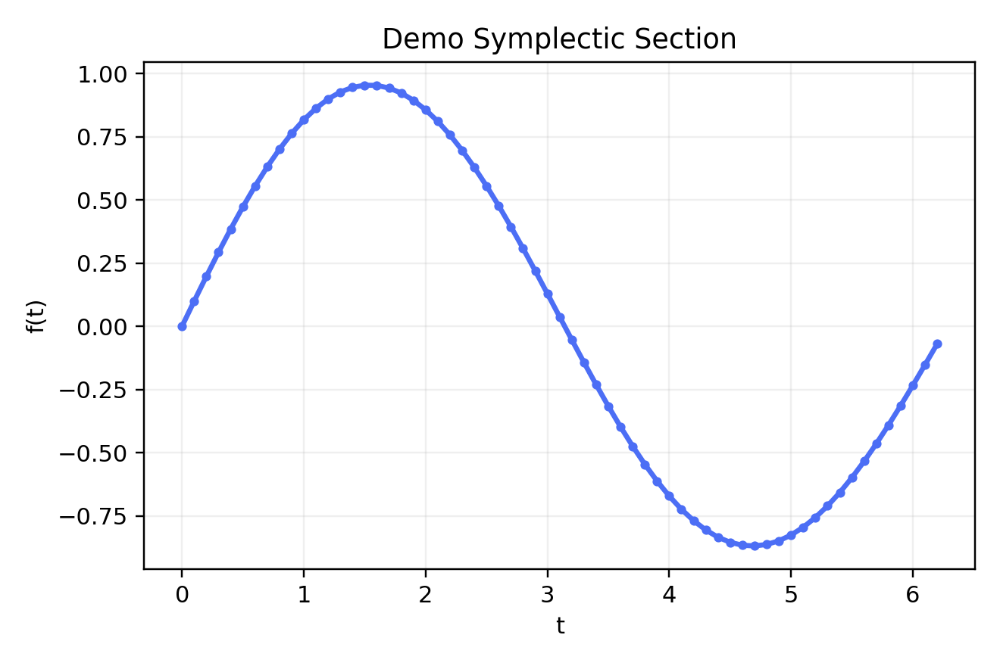

# Probing Viterbo's Conjecture – Overview (Draft)

This placeholder chapter exists so the docs site and the print pipeline have
something concrete to render. The actual content will summarize the algorithmic,
experimental, and formal proof contributions that investigate Viterbo's
conjecture in four dimensions.

The figure below is generated with the Python pipeline and checked into the
thesis sources so that agents can experiment with the interactive/static asset
workflow end-to-end.

Interactive renderings live on the docs site. The print/PDF pipeline will
continue to embed only the static PNG/SVG assets so the LaTeX conversion stays
deterministic.
